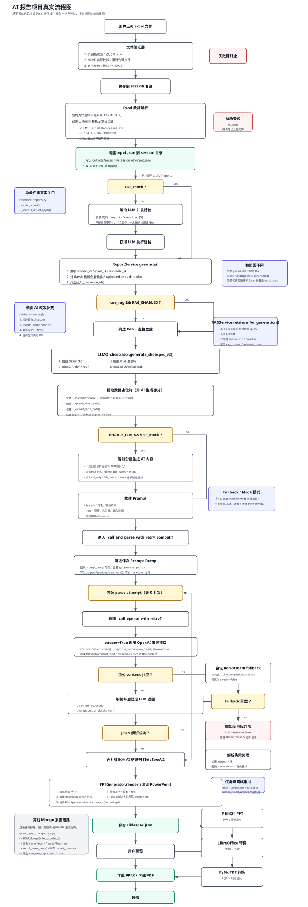

# AI 报告项目流程图



本文不是按 README 推断，而是按当前代码逐段核对后的“旧版流程图校正版”。

## 先说结论

1. 你给的旧图主干方向是对的：`上传 Excel -> 解析 -> session -> generate -> LLM/Mock -> PPT 渲染 -> 预览 -> 下载/评价`。
2. 但有几处现在已经变了，必须修正：
   - 生成阶段当前不是直接从 `session/input.json` 读数据，而是对经典模板再次解析 `uploaded.xlsx` 或 `data.xlsx`。
   - LLM 并发上限当前不是 3，而是 `5`。
   - AI 分批不是固定“>6000 拆分”，而是按估算 token 和页面策略做智能分批，默认 `max_tokens_per_batch=15000`。
   - RAG 现在在生成链路里是可选前置步骤；旧图里没有这一层。
   - AI 单页改写当前显式绕过 RAG。

## 旧图校正版流程图

```text
┌────────────────────┐
│ 用户上传 Excel 文件 │
└─────────┬──────────┘
          │
          v
┌──────────────────────────────────────┐
│ /api/v1/inputs/excel                 │
│ routers/v1/inputs.py::upload_excel   │
└─────────┬────────────────────────────┘
          │
          v
┌──────────────────────────────────────┐
│ ExcelHandler.process_upload()        │
│ modules/excel_handler.py             │
├──────────────────────────────────────┤
│ 1. validate_extension()              │
│    - 仅允许 .xlsx                    │
│ 2. validate_mime_type()              │
│    - 只接受 xlsx 对应 MIME           │
│ 3. validate_size()                   │
│    - 默认上限 50MB                   │
└─────────┬────────────────────────────┘
          │成功
          │
          v
┌──────────────────────────────────────┐
│ 保存到 session 目录                   │
│ outputs/sessions/{session_id}/       │
│ - uploaded.xlsx                      │
└─────────┬────────────────────────────┘
          │
          v
┌──────────────────────────────────────┐
│ ExcelDataExtractor.extract_data()    │
├──────────────────────────────────────┤
│ 当前不是只取 A2/B2/C2。               │
│ 对 classic 模板，已确认至少会读取：    │
│ - L1/M1: period_start/period_end     │
│ - D3/D4/D5/D6: 架构统计等             │
│ - 以及大量业务单元格映射              │
└─────────┬────────────────────────────┘
          │成功
          │
          v
┌──────────────────────────────────────┐
│ 写入 session/input.json              │
│ 返回 session_id                      │
└─────────┬────────────────────────────┘
          │
          │ 用户调用 /api/v1/reports
          v
┌──────────────────────────────────────┐
│ create_report()                      │
│ routers/v1/reports.py                │
├──────────────────────────────────────┤
│ 1. 生成/复用 browser_id              │
│ 2. 计算 idempotency_key              │
│ 3. JobManager.create_job()           │
│ 4. start_job()                       │
│ 5. 异步启动 _process_report_async()  │
└─────────┬────────────────────────────┘
          │
          v
┌──────────────────────────────────────┐
│ use_mock ?                           │
└───────┬───────────────────────┬──────┘
        │ yes                   │ no
        v                       v
┌──────────────────┐   ┌──────────────────────────────────┐
│ 直接进入生成流程   │   │ 等待 LLM 并发槽位                │
│ 不占 semaphore   │   │ app.py: asyncio.Semaphore(5)    │
└───────┬──────────┘   │ 当前真实上限 = 5                 │
        │              └──────────────┬───────────────────┘
        └─────────────────────────────┘
                                       │
                                       v
┌──────────────────────────────────────┐
│ ReportService.generate()             │
│ services/report_service.py           │
├──────────────────────────────────────┤
│ 1. 接收 session_id / input_id        │
│ 2. 判断 _should_parse_excel_runtime  │
│ 3. 对经典模板重新解析 Excel          │
└─────────┬────────────────────────────┘
          │
          v
┌───────────────────────────────────────────────────────┐
│ 这里和旧图不同：                                      │
├───────────────────────────────────────────────────────┤
│ 当前 generate() 对经典模板不会直接读取 session/input.json。 │
│ 它会优先读取：                                        │
│ 1. outputs/sessions/{session_id}/uploaded.xlsx       │
│ 2. catalog 配置的 excel_file                         │
│ 3. data/data.xlsx（classic_ops_dataxlsx）            │
│ 然后再次调用 ExcelDataExtractor.extract_data()，      │
│ 并重新覆盖 session/input.json。                      │
└─────────┬─────────────────────────────────────────────┘
          │
          v
┌──────────────────────────────────────┐
│ ReportService._generate_v2()         │
├──────────────────────────────────────┤
│ 1. clear template cache              │
│ 2. TemplateRepository 读取 descriptor│
│ 3. 可选执行 RAG 检索                 │
│ 4. 调 LLMOrchestrator.generate_...   │
│ 5. PPTGenerator.render()             │
│ 6. 保存 report.pptx / slidespec.json │
└─────────┬────────────────────────────┘
          │
          v
┌──────────────────────────────────────┐
│ 是否启用 RAG                         │
│ use_rag && RAG_ENABLED               │
└───────┬───────────────────────┬──────┘
        │ yes                   │ no
        v                       v
┌──────────────────────────────────────┐   ┌──────────────────┐
│ RAGService.retrieve_for_generation() │   │ 跳过 RAG         │
├──────────────────────────────────────┤   └──────────────────┘
│ - 基于 slide/task 构造检索 query     │
│ - 查询 Qdrant                        │
│ - 可用本地 embedding / reranker      │
│ - 返回 rag_context / trace           │
└─────────┬────────────────────────────┘
          │
          └──────────────────────────────┐
                                         v
┌──────────────────────────────────────────────────────┐
│ LLMOrchestrator.generate_slidespec_v2()             │
│ modules/llm_orchestrator.py                         │
├──────────────────────────────────────────────────────┤
│ 1. 加载 descriptor                                  │
│ 2. 创建空 SlideSpecV2                               │
│ 3. 提取非 AI 占位符                                  │
│ 4. 生成 AI 占位符                                    │
│ 5. 合并为完整 SlideSpecV2                            │
└─────────┬────────────────────────────────────────────┘
          │
          v
┌──────────────────────────────────────────────────────┐
│ 提取数据占位符（非 AI）                              │
├──────────────────────────────────────────────────────┤
│ - text/default: source -> format                    │
│ - chart: _extract_chart_data()                      │
│ - native_table: _extract_table_data()               │
│ - 结果直接写入 slidespec.placeholders                │
└─────────┬────────────────────────────────────────────┘
          │
          v
┌──────────────────────┐
│ ENABLE_LLM && !use_mock │
└───────┬───────────┬────┘
        │ yes       │ no
        v           v
┌──────────────────────────────────────┐   ┌──────────────────────┐
│ 智能分批生成 AI 内容                  │   │ Fallback / Mock 模式 │
├──────────────────────────────────────┤   ├──────────────────────┤
│ 不是固定 6000 拆分。                  │   │ _fill_ai_placeholders│
│ 当前真实逻辑：                        │   │ _with_fallback()     │
│ - max_tokens_per_batch = 15000       │   └─────────┬────────────┘
│ - 按 local_only / full_data 策略分批  │             │
│ - 按 prompt 估算 token 智能拆分       │             │
└─────────┬────────────────────────────┘             │
          │                                          │
          v                                          │
┌──────────────────────────────────────┐             │
│ 构建 Prompt                          │             │
├──────────────────────────────────────┤             │
│ - System: 角色、输出约束             │             │
│ - User: 当前批次页面、占位符、输入数据 │             │
│ - 可附带 RAG 上下文                  │             │
└─────────┬────────────────────────────┘             │
          │                                          │
          v                                          │
┌──────────────────────────────────────────────────────┐
│ 调 OpenAI 兼容接口                                   │
├──────────────────────────────────────────────────────┤
│ - chat.completions.create(stream=True)              │
│ - 空流响应时再 fallback 到 non-stream               │
│ - OpenAI SDK 自动重试已禁用（max_retries=0）         │
└─────────┬────────────────────────────────────────────┘
          │
          v
┌──────────────────────────────────────────────────────┐
│ 重试说明（当前真实逻辑）                             │
├──────────────────────────────────────────────────────┤
│ A. 整个生成任务的网络类重试：                         │
│    reports._process_report_async()                   │
│    max_attempts = settings.llm_retry_attempts        │
│    默认是 2 次总尝试，不是旧图里的固定 4 次。         │
│ B. LLM 输出格式解析重试：                            │
│    _call_and_parse_with_retry_compat()               │
│    max_parse_retries = 5                             │
└─────────┬────────────────────────────────────────────┘
          │
          v
┌──────────────────────────────────────┐
│ 合并 AI 结果到 SlideSpecV2           │
└─────────┬────────────────────────────┘
          │
          v
┌──────────────────────────────────────────────────────┐
│ PPTGenerator.render()                               │
│ modules/ppt_generator.py                            │
├──────────────────────────────────────────────────────┤
│ 1. 加载模板 PPTX                                     │
│ 2. 根据 descriptor 找占位符                          │
│ 3. 替换文本 / 图表 / 表格                            │
│ 4. 保存 outputs/sessions/{session_id}/report.pptx   │
│ 5. 保存时使用 FileLock 防并发写                      │
└─────────┬────────────────────────────────────────────┘
          │
          v
┌──────────────────────────────────────┐
│ 保存 slidespec.json                  │
└─────────┬────────────────────────────┘
          │
          v
┌──────────────────────────────────────────────────────┐
│ ReportService.preview()                              │
├──────────────────────────────────────────────────────┤
│ 1. 读取 report.pptx                                  │
│ 2. 复制临时文件避免锁冲突                            │
│ 3. LibreOffice: PPTX -> PDF                         │
│ 4. PyMuPDF: PDF -> PNG                              │
│ 5. 输出到 outputs/previews/{job_id}/slide*.png      │
│ 6. 命中缓存时可直接复用                              │
└─────────┬────────────────────────────────────────────┘
          │
          v
┌──────────────────────────────────────┐
│ JobManager.complete_job()            │
│ - 更新状态 completed                 │
│ - 写回 report_path/slidespec_path    │
│ - 保存 preview_urls / metadata       │
└─────────┬────────────────────────────┘
          │
          ├───────────────> WebSocket 推送进度/完成
          │
          ├───────────────> GET /jobs/{job_id}/status
          │
          ├───────────────> GET /reports/{job_id}/preview
          │
          ├───────────────> GET /reports/{job_id}/download
          │
          ├───────────────> GET /reports/{job_id}/download-pdf
          │
          v
┌────────────────────┐
│ 用户预览 / 下载 / 评价 │
└────────────────────┘
```

## 单页改写流程

```text
PATCH /api/v1/reports/{id}/slides
        或
POST  /api/v1/reports/{id}/slides/ai-rewrite
                 │
                 v
┌──────────────────────────────────────┐
│ ReportService.rewrite()              │
│ 或 ai_rewrite_slide()                │
└─────────┬────────────────────────────┘
          │
          ├─ 读取现有 slidespec.json
          ├─ 修改指定 slide 的 placeholders
          ├─ AI 改写时调用 rewrite_single_slide_v2()
          ├─ 保存新的 slidespec.json
          ├─ 重新 render report.pptx
          ├─ 强制重新生成 preview PNG
          └─ 更新 JobStore 和 WebSocket
```

补充一条当前真实行为：

- AI 单页改写代码里明确写了“`AI rewrite explicitly bypasses RAG retrieval`”，也就是这条链路当前不走 RAG。

## 离线 Mongo 采集流程

这条链路存在，但不在在线 `/generate` 主流程里。

```text
命令行脚本 export_soar_mongo_data.py
          │
          v
┌──────────────────────────────────────┐
│ SOARMongoCollector.collect()         │
├──────────────────────────────────────┤
│ 1. 查询 alarm 集合                    │
│ 2. 查询 event 集合                    │
│ 3. enrich_event_docs()               │
│    - 识别/处置/闭环时长               │
│ 4. 按 host_ip 回查 asset security_domain │
│ 5. 聚合 asset + business             │
│ 6. 导出 meta + alarm + event + asset │
└─────────┬────────────────────────────┘
          │
          ├──────────────> soar_raw_export.json
          └──────────────> soar_raw_export.xlsx
```

## 旧图里需要明确修正的点

1. `generate()` 当前对经典模板会重新解析 Excel，不是直接读取 `session/input.json`。
2. LLM 并发上限当前真实值是 `5`，来源于 [app.py](/f:/report-generation/mss_ai_ppt_sample_assets/backend/app.py:61)。
3. AI 分批不是固定阈值 6000，而是智能分批，入口在 [llm_orchestrator.py](/f:/report-generation/mss_ai_ppt_sample_assets/backend/modules/llm_orchestrator.py:1749)。
4. 生成链路已经有 RAG 前置检索，入口在 [report_service.py](/f:/report-generation/mss_ai_ppt_sample_assets/backend/services/report_service.py:459)。
5. 预览链路是后端 `PPTX -> PDF -> PNG`，不是前端直接渲染。
6. 单页 AI 改写会重新渲染 PPT 并重建预览，不只是改 JSON。

## 代码锚点

- 上传入口：[inputs.py](/f:/report-generation/mss_ai_ppt_sample_assets/backend/routers/v1/inputs.py:282)
- Excel 处理：[excel_handler.py](/f:/report-generation/mss_ai_ppt_sample_assets/backend/modules/excel_handler.py:930)
- 运行期 Excel 重解析：[report_service.py](/f:/report-generation/mss_ai_ppt_sample_assets/backend/services/report_service.py:310)
- 报告生成入口：[report_service.py](/f:/report-generation/mss_ai_ppt_sample_assets/backend/services/report_service.py:340)
- 异步任务与 semaphore：[reports.py](/f:/report-generation/mss_ai_ppt_sample_assets/backend/routers/v1/reports.py:246)
- 并发上限装配：[app.py](/f:/report-generation/mss_ai_ppt_sample_assets/backend/app.py:61)
- LLM 主流程：[llm_orchestrator.py](/f:/report-generation/mss_ai_ppt_sample_assets/backend/modules/llm_orchestrator.py:2319)
- 智能分批：[llm_orchestrator.py](/f:/report-generation/mss_ai_ppt_sample_assets/backend/modules/llm_orchestrator.py:1749)
- PPT 渲染：[ppt_generator.py](/f:/report-generation/mss_ai_ppt_sample_assets/backend/modules/ppt_generator.py:2193)
- 预览生成：[preview_generator.py](/f:/report-generation/mss_ai_ppt_sample_assets/backend/modules/preview_generator.py:337)
- RAG 生成检索：[rag_service.py](/f:/report-generation/mss_ai_ppt_sample_assets/backend/services/rag_service.py:1778)
- Mongo 离线采集：[mongo_collector.py](/f:/report-generation/mss_ai_ppt_sample_assets/backend/services/data_ingestion/collectors/mongo_collector.py:278)
